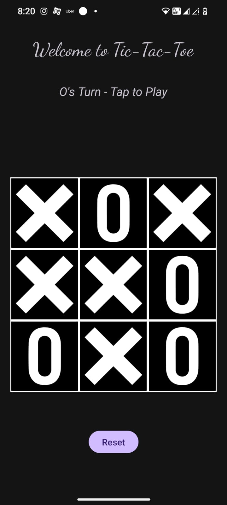

# Kotlin Tic Tac Toe (Android)

A simple Tic Tac Toe game built with **Kotlin** as part of my Android learning journey.  
This project was based on a Java tutorial series, but I rewrote it entirely in Kotlin and added my own features.

---

## Features

- Two-player local Tic Tac Toe
- Custom UI layout (colors, layout tweaks)
- Win/draw detection

---

## Tech Stack

- Kotlin
- Android Studio
- Constraint Layout

---

## Learning Highlights

- Migrated Java logic to Kotlin independently
- Used buttons, arrays, and conditional logic
- Practiced layout design and activity lifecycle
- First real app project using Android Studio

---

## Demo

### Home Screen


---

## Folder Structure
```
TicTacToe-Kotlin  
├── app  
│   └── src  
│       └── main  
│           ├── java  
│           │   └── com  
│           │       └── yourname  
│           │           └── tictactoe  
│           │               └── MainActivity.kt  
│           ├── res  
│           │   ├── layout  
│           │   │   └── activity_main.xml  
│           │   ├── drawable  
│           │   └── values  
│           │       ├── colors.xml  
│           │       ├── strings.xml  
│           │       └── styles.xml  
│           └── AndroidManifest.xml  
├── build.gradle  
└── README.md
```


---

## What's Next

- Add AI mode (1-player)
- Add animations

---

## Connect

Feel free to check out more of my work on [GitHub](https://github.com/BHuvaneshvar933)


